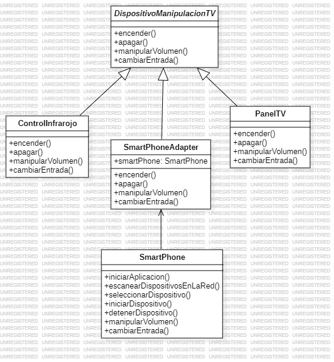

# Ejercicio Patrones

Creación del sistema para relacionar diferentes dispositivos para la manipalación de un TV mediante el uso de clases como **ControlInfrarojo**, **PanelTV** y se implementa patron de diseño **Adapter** para relacionar las diferentes acciones para un dispositivo **SmartPhone**.

## Diagrama de de clase


## Uso del Proyecto

Clona este repositorio en tu maquina local:

```BASH
git clone https://github.com/jstorra/PatronesJuanTorra.git
```

---

<p align="center">Developed by <a href="https://github.com/jstorra">@jstorra</a></p>